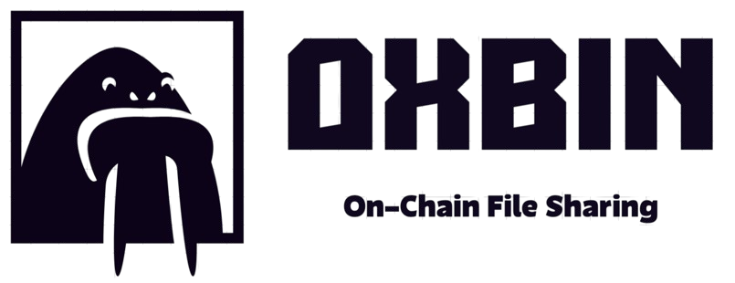

<div align="center">



</div>

# OxBin - Walrus Pastebin CLI

A beautiful terminal-based pastebin application built with [Bubble Tea](https://github.com/charmbracelet/bubbletea) that uses the [Walrus Protocol](https://www.walrus.xyz/) for decentralized file storage.

## ✨ Features

- 📤 **Upload Files**: Store any file on the Walrus decentralized storage network
- 📥 **Read Files**: Retrieve files using their Blob ID
- 🎨 **Beautiful TUI**: Intuitive terminal user interface built with Bubble Tea
- 🔒 **Decentralized**: Powered by Walrus Protocol on Sui blockchain
- 💾 **Save Locally**: Download retrieved files to your local system
- 🚀 **Fast & Reliable**: Built with Go for performance
- ⚡ **Zero Configuration**: Pre-configured with reliable Walrus endpoints
- 📱 **Responsive**: Adapts to any terminal size
- 📋 **Clipboard Integration**: Automatic Blob ID copying to clipboard
- 🌐 **Browser Integration**: Open files directly in your browser
- 🔍 **WalrusScan Integration**: Explore blobs on WalrusScan
- 🎯 **Post-Upload Actions**: Multiple options after successful upload
- 📋 **File Metadata**: Stores filename, extension, size, and upload time
- 🔄 **Smart Retrieval**: Preserves original filenames and file information

## 🚀 Quick Start

### Prerequisites

- Go 1.19 or later
- Internet connection for accessing Walrus network

## 📦 Installation Guide

### Option 1: Install using go

```bash
# Install latest version
go install github.com/smrnjeet222/oxbin/cmd/oxbin@latest

# Run from anywhere (make sure $GOPATH/bin is in your PATH)
oxbin
```

### Option 2: Build from Source

#### Clone and Build

```bash
# Clone the repository
git clone https://github.com/smrnjeet222/oxbin.git
cd oxbin

# Build using Make
make build

# Or build manually
go build -o bin/oxbin ./cmd/oxbin

# Run the application
./bin/oxbin
```

## 🎯 Quick Usage

### First Time Usage

1. **Install OxBin** using any method above
2. **Run the application**:
   ```bash
   oxbin
   ```
3. **Upload your first file**:
   - Select "📤 Upload File"
   - Choose a file from your system
   - Copy the generated Blob ID
4. **Retrieve the file**:
   - Select "📥 Read File"  
   - Enter the Blob ID
   - View or save the file


## 🆘 Troubleshooting

### Common Issues

**Command not found**
```bash
# Make sure the binary is in your PATH
echo $PATH
which oxbin

# Or run from current directory
./oxbin
```

**Permission denied**
```bash
# Make the binary executable
chmod +x oxbin
```

**Network errors**
```bash
# Check internet connection
curl -I https://publisher.walrus-testnet.walrus.space

# Run with debug output
oxbin --debug
```

**File upload fails**
- Check file size (default limit: 10MB)
- Verify file permissions
- Try with a smaller file first

### Getting Help

- 📖 **Documentation**: Read this README and inline help
- 🐛 **Bug Reports**: [GitHub Issues](https://github.com/smrnjeet222/oxbin/issues)
- 💬 **Discussions**: [GitHub Discussions](https://github.com/smrnjeet222/oxbin/discussions)
- 📧 **Contact**: [your-email@example.com](mailto:your-email@example.com)

## ⚡ Pro Tips

### Keyboard Shortcuts
- **↑/↓ Arrow Keys**: Navigate menus
- **Enter**: Select option
- **Esc**: Go back/cancel
- **Ctrl+C**: Exit application
- **Tab**: Navigate form fields

### Workflow Tips
1. **Keep Blob IDs handy**: Save important Blob IDs in a text file
2. **Use meaningful filenames**: They're preserved in metadata
3. **Test with small files first**: Verify connectivity before large uploads
4. **Bookmark the web interface**: For easy browser access to blobs

### File Metadata

OxBin automatically stores and preserves file metadata when uploading files:

#### What's Stored
- **Filename**: Original filename with extension
- **File Size**: Size in bytes (displayed in human-readable format)  
- **Content Type**: MIME type based on file extension
- **Upload Time**: When the file was uploaded
- **Version**: Metadata format version

#### How It Works
- Files are wrapped in a JSON structure with metadata before uploading to Walrus
- Original file content is base64-encoded within the wrapper
- When retrieving files, OxBin automatically detects and unwraps the metadata
- Non-OxBin files (uploaded elsewhere) are displayed as raw content

#### Blob Format
When you upload a file through OxBin, it's stored in this JSON format:

```json
{
  "metadata": {
    "filename": "example.txt",
    "extension": ".txt",
    "size": 1024,
    "contentType": "text/plain",
    "uploadTime": "2024-01-15T10:30:00Z",
    "version": "1.0"
  },
  "content": "SGVsbG8gV29ybGQh",
  "type": "oxbin-file"
}
```

- **metadata**: Contains file information (name, size, type, upload time)
- **content**: Base64-encoded original file content
- **type**: Always "oxbin-file" to identify OxBin uploads

This format ensures:
- ✅ **Backward Compatibility**: Works with any Walrus blob
- ✅ **Rich Metadata**: Preserves file context and information
- ✅ **Content Integrity**: Original file is perfectly preserved
- ✅ **Type Detection**: Automatic identification of OxBin vs raw blobs

#### Benefits
- **Preserve Context**: Know what file you're looking at
- **Smart Saving**: Original filenames are suggested when saving
- **Better Organization**: See upload dates and file types at a glance
- **Backward Compatible**: Works with any blob stored on Walrus

### Configuration

OxBin uses hardcoded, reliable Walrus endpoints for optimal performance and simplicity:

- **Primary Publisher**: `https://publisher.walrus-testnet.walrus.space`
- **Primary Aggregator**: `https://aggregator.walrus-testnet.walrus.space`
- **Backup Publisher**: `https://walrus-publisher-testnet.staking4all.org`
- **Backup Aggregator**: `https://walrus-testnet-aggregator.staking4all.org`

The application automatically uses backup endpoints if primary ones are unavailable.

## 🔧 Advanced Features

### Responsive UI
The interface automatically adapts to your terminal size:
- **Small terminals** (< 50 chars): Compact layout with essential information
- **Medium terminals** (50-80 chars): Standard layout with full features
- **Large terminals** (> 80 chars): Expanded layout with detailed information

### Error Handling
- **Network timeouts**: 60 seconds for uploads, 30 seconds for downloads
- **Connection issues**: Automatic retry suggestions
- **Invalid files**: Clear error messages with guidance
- **Endpoint failures**: Automatic fallback to alternative endpoints

## 🔧 Dependencies

- [Bubble Tea](https://github.com/charmbracelet/bubbletea) - TUI framework
- [Bubbles](https://github.com/charmbracelet/bubbles) - TUI components (filepicker, textinput, viewport, spinner)
- [Lip Gloss](https://github.com/charmbracelet/lipgloss) - Terminal styling
- [Walrus Go SDK](https://github.com/namihq/walrus-go) - Walrus Protocol integration

## 🌐 About Walrus Protocol

Walrus is a decentralized storage and data availability protocol built on Sui. It provides:
- **Cost-effective storage** for large data blobs
- **High availability** and fault tolerance
- **Censorship resistance** through decentralization
- **Integration** with the Sui blockchain ecosystem

Learn more at [walrus.site](https://walrus.site)

## 🔗 Endpoint Information

OxBin automatically discovers endpoints from the official Walrus documentation. Current working endpoints include:

### Testnet (Recommended for Development)
- **Publisher**: `https://publisher.walrus-testnet.walrus.space`
- **Aggregator**: `https://aggregator.walrus-testnet.walrus.space`

### Mainnet (Production)
- **Publisher**: `https://publisher.walrus-mainnet.walrus.space`
- **Aggregator**: `https://aggregator.walrus-mainnet.walrus.space`

For a complete list of available endpoints, see the [official documentation](https://docs.wal.app/usage/web-api.html).

## 🤝 Contributing

Contributions are welcome! Please feel free to submit a Pull Request.

## 📄 License

This project is open source and available under the MIT License.

## 🔗 Links

- [Walrus Protocol](https://walrus.site)
- [Walrus Documentation](https://docs.wal.app/usage/web-api.html)
- [Walrus Go SDK](https://github.com/namihq/walrus-go)
- [Bubble Tea](https://github.com/charmbracelet/bubbletea)
- [Sui Blockchain](https://sui.io)

---

Built with ❤️ using Go, Bubble Tea, and Walrus Protocol
